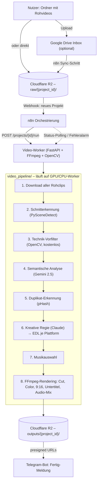

# Architektur: KI-Workflow für automatisches Immobilienmarketing

Status: Entwurf + funktionsfähiges Code-Gerüst (`video_pipeline/`). Ehrlicher
Hinweis vorab: Claude Code kann in dieser Umgebung keine Videodateien
öffnen, dekodieren oder rendern — genau das ist der Grund, warum die
Architektur unten so aussieht, wie sie aussieht. Alles, was echte
Videobytes anfasst (Rendering, Frame-Sampling), läuft auf einem separaten
Worker mit FFmpeg/OpenCV, den n8n ansteuert. Was in diesem Repo hier neu
committed wurde, ist der **vollständige Code für diesen Worker** sowie die
**Orchestrierung** — nicht getestet mit echtem 4K-Material (das kann in
dieser Session nicht passieren), aber lauffähig, sobald API-Keys und ein
Deployment-Ziel (siehe README.md) vorhanden sind.

## 1. Kernentscheidung: Wer macht was

| Schicht | Werkzeug | Warum |
|---|---|---|
| Speicher (Rohvideos, Outputs) | **Cloudflare R2** | S3-kompatibel, **keine Egress-Kosten** — bei 20-100 Clips à mehrere GB, die pro Projekt mehrfach gelesen werden (Schnitterkennung, Qualitätsanalyse, Vision-API-Sampling, Rendering, 3 Output-Uploads), ist das der größte Hebel gegen explodierende Storage-Kosten. |
| Komfort-Upload | **Google Drive** (optional) | Der Nutzer kennt Drive, muss keinen S3-Client lernen. Ein Sync-Schritt kopiert neue Projektordner nach R2, bevor die eigentliche Verarbeitung beginnt. |
| Orchestrierung | **n8n** (self-hosted, selbe Infra wie der bestehende Telegram-Bot) | Trigger, Retry-Logik, Statuspolling, Fehlerbenachrichtigung — ohne dass wir eine eigene Job-Queue bauen müssen. Sichtbar/bearbeitbar für Nicht-Entwickler:innen. |
| Technische Vorfilterung | **OpenCV** (lokal, kein API-Call) | Schärfe (Laplacian-Varianz), Wackeln (optischer Fluss), Belichtung (Histogramm), Farbigkeit — filtert 30-50 % des Materials **kostenlos** aus, bevor teure KI-Aufrufe überhaupt stattfinden. |
| Schnitterkennung | **PySceneDetect** | Standard-Open-Source-Tool für Shot-Boundary-Detection; zerlegt lange Gimbal-Walks zusätzlich in feste Zeitfenster, damit die Regie einzelne Momente statt ganzer Rundgänge wählen kann. |
| Semantisches Videoverständnis | **Google Gemini 2.5** (Flash für Bulk, Pro für Feinbewertung) | Einziges Modell am Markt, das Video **nativ** versteht (nicht nur Einzelbilder) — entscheidend für Kameraführung, Schwenk-Dynamik, Bewegungsfluss, die der Auftrag explizit als Kriterien nennt. Zwei-Stufen-Einsatz hält die Kosten trotzdem niedrig. |
| Kreative Regie / Schnittentscheidung | **Claude** (Opus/Sonnet, über die Anthropic API) | Sobald Video in strukturierte Metadaten übersetzt ist, wird die Aufgabe zu Text-Reasoning unter vielen Nebenbedingungen (Zieldauer, Hook-Regel, Erzählbogen, Plattform-Unterschiede) — Claudes Stärke. Trennung „Gemini sieht, Claude entscheidet" hält beide Modelle in ihrer besten Disziplin und macht Entscheidungen nachvollziehbar. |
| Rendering | **FFmpeg** (mit optionalem NVENC) | Der Schnitt steht bereits fest — hier zählt deterministische, schnelle, GPU-beschleunigbare Ausführung, kein weiterer KI-Aufruf. |
| Untertitel/Transkription | **faster-whisper** (Whisper, self-hosted) | Nur relevant, falls Ton/O-Ton vorhanden ist; self-hosted spart API-Kosten bei stundenlangem Rohmaterial. |
| Musik | **Epidemic Sound/Artlist API** (lizenziert) mit Fallback auf freie Bibliothek | Kommerziell sicher (kein Copyright-Strike-Risiko auf TikTok/Meta/YouTube); Fallback hält die Pipeline auch ohne bezahlten Musik-Account lauffähig. |
| Benachrichtigung | **bestehender Telegram-Bot** (`BOT_TOKEN`/`ADMIN_ID`) | Wiederverwendung der bereits etablierten Nutzeroberfläche dieses Repos statt eines neuen Kanals. |

## 2. High-Level-Architektur



## 3. Datenfluss im Detail

1. **Upload.** Rohvideos landen unter `raw/{project_id}/` in R2 (direkt oder
   über eine Drive-Inbox, die n8n synct).
2. **Trigger.** Ein Webhook an n8n startet den Job für `project_id`
   (`n8n/real-estate-video-workflow.json`).
3. **Worker-Start.** n8n ruft `POST /projects/{id}/run` auf dem Video-Worker
   auf (`video_pipeline/webhook_server.py`), der die Pipeline im Hintergrund
   startet und sofort antwortet.
4. **Schnitterkennung** (`scene_detect.py`). Jede Rohdatei wird in einzelne
   Einstellungen zerlegt; lange ungeschnittene Rundgänge werden zusätzlich
   in ~8-Sekunden-Häppchen unterteilt.
5. **Technik-Vorfilter** (`technical_quality.py`). Schärfe, Stabilität,
   Belichtung, Farbigkeit — alles ohne API-Kosten. Etwa ein Drittel bis die
   Hälfte des Materials fällt hier normalerweise schon raus.
6. **Semantische Analyse** (`vision_gemini.py`). Gemini Flash klassifiziert
   jede überlebende Szene (Raumtyp aus der geforderten Liste — Außenansicht,
   Eingang, Wohnzimmer, Küche, ... —, Luxusdetails, Licht, Architektur,
   Kameraführung, emotionale Wirkung, Social-Media-Potenzial). Gemini Pro
   bewertet danach nur die Top-3-Kandidaten je Raumtyp noch einmal genauer.
7. **Duplikat-Filter** (`scene_detect.mark_duplicates`). Perceptual Hashing
   erkennt fast identische Szenen (z. B. drei sehr ähnliche
   Wohnzimmer-Schwenks) und behält nur die beste.
8. **Kreative Regie** (`director_claude.py`). Claude bekommt **nur** die
   strukturierten Metadaten aller verbliebenen Szenen (kein Video!) und
   trifft die komplette Schnittentscheidung: Szenenauswahl, Reihenfolge,
   Hook in den ersten 3 Sekunden, Übergänge, On-Screen-Text, Musikstimmung,
   Color-Grade-Preset — je Plattform separat, da TikTok/Reels/Shorts
   unterschiedliche Ziel-Längen haben.
9. **Musik** (`music.py`). Track passend zur von Claude gewählten Stimmung,
   lizenziert (Epidemic Sound/Artlist) oder aus der freien Fallback-Bibliothek.
10. **Rendering** (`render.py`). FFmpeg baut pro Plattform eine
    filter_complex-Kette: Trim + Speed-Ramp + Color-Grade + Crop auf 9:16 pro
    Clip, Übergänge zwischen den Clips, Untertitel-/Text-Overlay (ASS,
    `captions.py`), Musikbett mit Loudness-Normalisierung.
11. **Output & Benachrichtigung.** Die drei fertigen MP4s gehen zurück nach
    R2 (`outputs/{project_id}/`); der Worker verschickt presigned Links per
    Telegram (`notify.py`), n8n überwacht den Job nur auf Fehlerfälle.

## 4. Das zentrale Datenmodell: die EDL (Edit Decision List)

Alle Stufen kommunizieren über typisierte, JSON-serialisierbare Objekte
(`video_pipeline/models.py`), nicht über Video-Bytes selbst:

```
Scene            → eine Einstellung mit TechnicalScore + SceneAnalysis
EDLClip          → ein von der Regie ausgewählter Ausschnitt einer Scene
                    (in/out, Übergang, Speed-Ramp, On-Screen-Text)
EDLProject       → die vollständige Schnittentscheidung EINER Plattform-
                    Variante (Clips, Hook, CTA, Musik-Stimmung, Color-Grade)
```

Das ist bewusst so gewählt: Jede Stufe lässt sich einzeln testen,
debuggen und – für die Erweiterbarkeit (Punkt 6) – später auch durch ein
manuelles Override-UI ersetzen, ohne die übrigen Stufen anzufassen.

## 5. Kostenschätzung (grobe Richtwerte, Stand 2026)

Für ein typisches Objekt mit 50 Rohclips (~90 Minuten Material vor der
Vorfilterung):

| Posten | Größenordnung |
|---|---|
| OpenCV-Vorfilterung | 0 € (lokale Rechenzeit auf dem Worker) |
| Gemini Flash (Bulk-Klassifikation, ~150 Szenen nach Vorfilter) | wenige Cent bis niedriger einstelliger €-Betrag |
| Gemini Pro (Feinbewertung, ~30-40 Top-Kandidaten) | niedriger einstelliger €-Betrag |
| Claude (3× Regie-Entscheidung, eine je Plattform) | Cent-Bereich (reines Text-Reasoning über kompakte JSON-Metadaten) |
| Whisper (nur falls O-Ton vorhanden) | 0 € (self-hosted) |
| FFmpeg-Rendering (GPU-Worker-Minuten) | abhängig vom Hosting; NVENC macht 3× 9:16-Export für ein 30-60s-Video zur Sache weniger Minuten |
| R2-Storage | ~0,015 $/GB/Monat, kein Egress |

Der dominante Kostenfaktor ist realistisch die Worker-Rechenzeit
(GPU-Miete), nicht die KI-API-Aufrufe — daher der Fokus der Architektur auf
aggressive Vorfilterung, bevor überhaupt gerendert wird.

## 6. Erweiterbarkeit (bewusst vorgesehene Ausbaustufen)

- **Smart Reframe statt Center-Crop**: `render.py` croppt aktuell zentriert
  auf 9:16 (klar als TODO markiert). Ausbaustufe: Gemini liefert pro Szene
  eine Bounding-Box des Hauptmotivs, `render.py` nutzt sie als Crop-Offset.
- **Manuelles Override-UI**: Da die EDL bereits als JSON vorliegt, kann eine
  einfache Web-Oberfläche sie vor dem Rendering anzeigen/anpassen lassen,
  ohne die Pipeline selbst zu ändern.
- **Automatisches Posting**: n8n kann um TikTok-/Meta-/YouTube-Publish-Nodes
  erweitert werden, sobald die Outputs in R2 liegen.
- **A/B-Hook-Varianten**: `director_claude.py` lässt sich leicht so
  erweitern, dass es 2-3 alternative Hooks liefert, die getestet werden.
- **Mehrsprachige Untertitel**: `captions.py` ist bereits pro Plattform
  parametrisiert; zusätzliche Sprachen sind ein zusätzlicher Whisper-
  Übersetzungsschritt.
- **Höherer Durchsatz**: `pipeline.py` ist bewusst als einfache Sequenz
  gehalten; für mehrere Objekte gleichzeitig lässt sich eine Queue (Celery/
  RQ) vor `run_project()` schalten, ohne die Stufen selbst zu ändern.

## 7. Was noch fehlt, um live zu gehen

Diese Session konnte den Code schreiben, aber **nicht** mit echtem
Videomaterial testen (siehe Hinweis oben — genau das ist die
Systemgrenze, die diese Architektur umgeht, indem sie die Verarbeitung auf
einen externen Worker auslagert). Vor dem produktiven Einsatz:

1. API-Keys besorgen: `GEMINI_API_KEY`, `ANTHROPIC_API_KEY`, optional
   `EPIDEMIC_SOUND_API_KEY`.
2. Cloudflare-R2-Bucket + Zugangsdaten anlegen.
3. Worker deployen (siehe `docs/video-automation/README.md`) — braucht
   FFmpeg + genug Rechenleistung für 4K/60fps, idealerweise mit GPU (NVENC).
4. n8n-Workflow importieren (`n8n/real-estate-video-workflow.json`) und
   Umgebungsvariablen/Telegram-Credential setzen.
5. Mit 1-2 echten Testobjekten durchlaufen lassen, Farb-Presets und
   Musik-Fallback-Bibliothek nach Geschmack anpassen.
